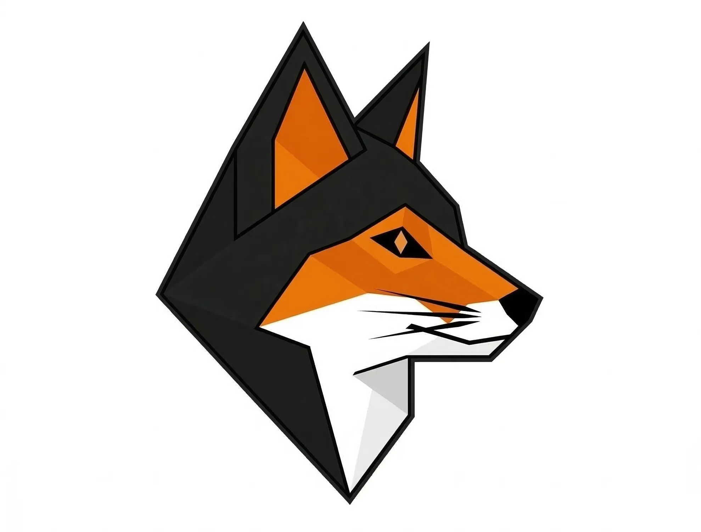

<div align="center">
  
</div>

<p align="center">
  <strong>Go Scraping Framework with Native Camoufox Anti-Detection</strong>
</p>

# Foxhound v0.0.9

High-performance Go scraping framework with native Camoufox anti-detection, dual-mode fetching, and 13-layer middleware.

## Highlights

- **Dual-mode fetching**: TLS-impersonating HTTP client (~5-50ms) + Camoufox browser (~500ms-5s), with automatic escalation on block detection
- **Consistent identity profiles**: UA + TLS fingerprint + header order + OS + hardware + screen + locale all match — randomness without consistency causes instant blocks
- **13-layer middleware chain**: concurrency, metrics, rate limit, robots.txt, delta-fetch, dedup, autothrottle, cookies, referer, blocked detector, redirect, depth limit, retry
- **Trail API**: fluent navigation builder with Fill, InfiniteScroll, Evaluate (custom JS), XHR/fetch capture, and optional steps
- **Structured data extraction**: JSON-LD, OpenGraph, NextData, NuxtData extractors + contact deobfuscation (CloudFlare cfemail)
- **NopeCHA auto-download**: CAPTCHA-solving extension fetched and configured automatically at runtime
- **9 export formats**: JSON, JSONL, CSV, Markdown, Text, XML, SQLite, PostgreSQL, Webhook
- **Parsing engine**: HTML table extraction (colspan/rowspan), JS preloaded data (Next.js/Nuxt/Redux), directory listings (JSON-LD/Microdata/DOM), pagination detection, and auto-detection with Readability-style article scoring
- **Adaptive parsing**: CSS pseudo-selectors (`::text`, `::attr`), similarity matching, auto-selector generation + sitemap/RSS/Atom parsing
- **Streaming API**: `Hunt.Stream(ctx)` for real-time item processing via Go channels
- **Checkpoint/resume**: auto-save hunt state every N items
- **18 packages, 1100+ tests**

## Key Capabilities

| Area | What you get |
|------|-------------|
| **Performance** | CSS parsing in ~8ms for 5K elements. Multi-core goroutines with per-domain concurrency control |
| **Anti-detection** | Real Camoufox binary (C++ fingerprint spoofing), human behavior simulation (log-normal timing, Bezier mouse, scroll rhythm), NopeCHA auto-download |
| **Block avoidance** | 9 vendor patterns (Cloudflare, Akamai, DataDome, PerimeterX) with auto-retry + reCAPTCHA checkbox click + Turnstile handler |
| **Identity** | 60+ device profiles with consistent UA + TLS + headers + OS + GPU + screen + locale + geo matching |
| **Trail API** | Fill forms (`JobStepFill`), infinite scroll with container + stop condition, `Evaluate` custom JS, XHR/fetch capture, optional steps, persistent cookies |
| **Parsing** | CSS + XPath + regex + JSON + structured schema + adaptive selectors + similarity matching + pseudo-selectors + sitemap/RSS/Atom |
| **Structured data** | JSON-LD, OpenGraph, NextData, NuxtData extractors + CloudFlare cfemail deobfuscation |
| **Export** | 9 formats: JSON, JSONL, CSV, Markdown (table/list/cards), Text, XML, SQLite, PostgreSQL, Webhook + field-level pipeline transforms |
| **Proxy** | Pool rotation, health checking, cooldown, geo-targeted selection matching identity locale |
| **Queue** | Memory, Redis (distributed), SQLite (persistent) — checkpoint/resume across restarts |
| **Monitoring** | Prometheus metrics + webhook alerting with error/block rate thresholds |
| **Scaling** | `docker compose --scale foxhound=4` with shared Redis queue |

## Quick Start

```bash
git clone https://github.com/sadewadee/foxhound.git
cd foxhound
go build -o foxhound ./cmd/foxhound/
foxhound init myproject && cd myproject
go mod tidy
foxhound run --config config.yaml          # default: headed mode
foxhound run --config config.yaml --headless  # headless Camoufox
```

Scrape books.toscrape.com in under 20 lines:

```go
h := engine.NewHunt(engine.HuntConfig{
    Name:    "books",
    Domain:  "books.toscrape.com",
    Walkers: 3,
    Fetcher: fetch.NewStealth(fetch.WithIdentity(identity.Generate())),
    Queue:   queue.NewMemoryQueue(),
    Processor: foxhound.ProcessorFunc(func(ctx context.Context, resp *foxhound.Response) (*foxhound.Result, error) {
        doc, _ := parse.NewDocument(resp)
        item := foxhound.NewItem()
        item.Set("title", doc.Text("h1"))
        return &foxhound.Result{Items: []*foxhound.Item{item}}, nil
    }),
    Seeds: []*foxhound.Job{{URL: "http://books.toscrape.com/", FetchMode: foxhound.FetchStatic}},
})
h.Run(context.Background())
```

### Trail API — Fill + Infinite Scroll

```go
trail := engine.NewTrail(fetcher).
    Navigate("https://example.com/search").
    Fill("input[name=q]", "foxhound scraper").
    Click("button[type=submit]").
    WaitFor(".results").
    InfiniteScrollUntil(".results-container", func(count int) bool {
        return count >= 100 // stop after 100 items loaded
    }).
    Evaluate(`document.querySelectorAll(".item").length`). // custom JS
    Extract(".result-item", map[string]string{
        "title": "h3::text",
        "url":   "a::attr(href)",
    })

items, err := trail.Run(ctx)
```

## Real Scraping Results

| Target | Mode | Items | Block Avoidance | Notes |
|--------|------|-------|-----------------|-------|
| books.toscrape.com | Static | **1,000 books** | 100% | 50 pages, 15s, 0 blocks |
| Google Maps (10 queries) | Camoufox + proxy | **100 places** | 100% | 1,297 items/hour, 0 CAPTCHAs |
| Alibaba (yoga mat) | Camoufox + proxy | **10 products** | 100% | Prices + suppliers extracted |
| bot.sannysoft.com | Camoufox | 29/30 PASS | — | webdriver NOT detected |
| CreepJS | Camoufox | Trust: HIGH | — | Fingerprint consistent |

## Benchmarks

### CSS Selection — 5,000 elements (Apple M1)

| Library | Language | Time | vs Foxhound |
|---------|----------|------|-------------|
| **Foxhound CSS** | Go | **8.6ms** | **1.0x** |
| Raw goquery | Go | 8.8ms | 1.0x |
| Raw lxml | Python/C | 195.8ms | 22.8x slower |
| Python CSS (lxml-based) | Python/C | 205.0ms | 23.8x slower |
| BeautifulSoup | Python | 245.6ms | 28.6x slower |

Go's runtime + goquery CSS engine significantly outperforms Python-based parsers on the same HTML.

### Foxhound Internal Benchmarks

| Method | Time (5K) | Memory | Notes |
|--------|-----------|--------|-------|
| Foxhound CSS | 8.6ms | 6.5 MB | <1% overhead vs raw goquery |
| Foxhound Adaptive | 8.4ms | 6.2 MB | Zero overhead when selector works |
| Foxhound Schema | 16.2ms | 13.3 MB | 3 fields per item |
| Foxhound TextExtract | 13.8ms | 10.0 MB | 3 fields per item |
| Similarity score | **77ns** | 0 B | Zero allocation |
| Item.ToJSON | 672ns | 432 B | — |
| Item.ToMarkdown | 407ns | 376 B | — |

```bash
# Run yourself
go test -bench=. -benchmem ./benchmarks/
```

## Documentation

| File | Contents |
|------|----------|
| [docs/getting-started.md](docs/getting-started.md) | Install, first scrape, running modes |
| [docs/configuration.md](docs/configuration.md) | Full config.yaml reference |
| [docs/cli.md](docs/cli.md) | All CLI commands and flags |
| [docs/api.md](docs/api.md) | Go types, interfaces, Hunt/Stream API |
| [docs/anti-detection.md](docs/anti-detection.md) | Identity system, TLS, behavior simulation |
| [docs/parsing.md](docs/parsing.md) | Table, preload, directory, pagination, auto-detection parsers |
| [docs/middleware.md](docs/middleware.md) | All 13 middleware, chain order |
| [docs/pipeline.md](docs/pipeline.md) | Pipeline stages and all 9 export formats |
| [docs/proxy.md](docs/proxy.md) | Proxy pool, rotation, providers, geo matching |
| [docs/browser.md](docs/browser.md) | Camoufox setup, options, human simulation |
| [docs/examples.md](docs/examples.md) | E-commerce, Maps, adaptive parsing, streaming |
| [docs/deployment.md](docs/deployment.md) | Docker, scaling, environment variables |

## Export Formats

| Format | Constructor | Notes |
|--------|-------------|-------|
| JSON array | `export.NewJSON(path, export.JSONArray)` | Single file, full array |
| JSON Lines | `export.NewJSON(path, export.JSONLines)` | One object per line, streaming-friendly |
| CSV | `export.NewCSV(path, cols...)` | Fixed or auto-inferred columns |
| Markdown table | `export.NewMarkdown(path, export.MarkdownTable)` | GFM pipe table |
| Markdown list | `export.NewMarkdown(path, export.MarkdownList)` | Bullet list, first field bolded |
| Markdown cards | `export.NewMarkdown(path, export.MarkdownCards)` | H2 heading + bullet fields |
| Plain text lines | `export.NewText(path, export.TextLines)` | `key=value` per line |
| Plain text pretty | `export.NewText(path, export.TextPretty)` | Labelled blocks with separators |
| XML | `export.NewXML(path, root, item)` | Configurable root/item element names |
| SQLite | `export.NewSQLite(dbPath, table)` | Auto-creates and extends schema |
| PostgreSQL | `export.NewPostgres(dsn, table)` | Upsert support, batch inserts |
| Webhook | `export.NewWebhook(url)` | HTTP POST, optional batch size |

## Architecture

```
Job → rate limit → dedup → behavior timing → header enrichment
  → Smart Fetcher (static TLS or Camoufox browser)
    → Block detection (9 vendor patterns) → retry with backoff
  → Parser (CSS / XPath / JSON / Regex / Adaptive / Similarity)
  → User Process() → Result{Items, NextJobs}
  → Pipeline (validate, clean, dedup) → Writers (9 formats)
  → Queue (memory / Redis / SQLite)
```

## License

MIT
